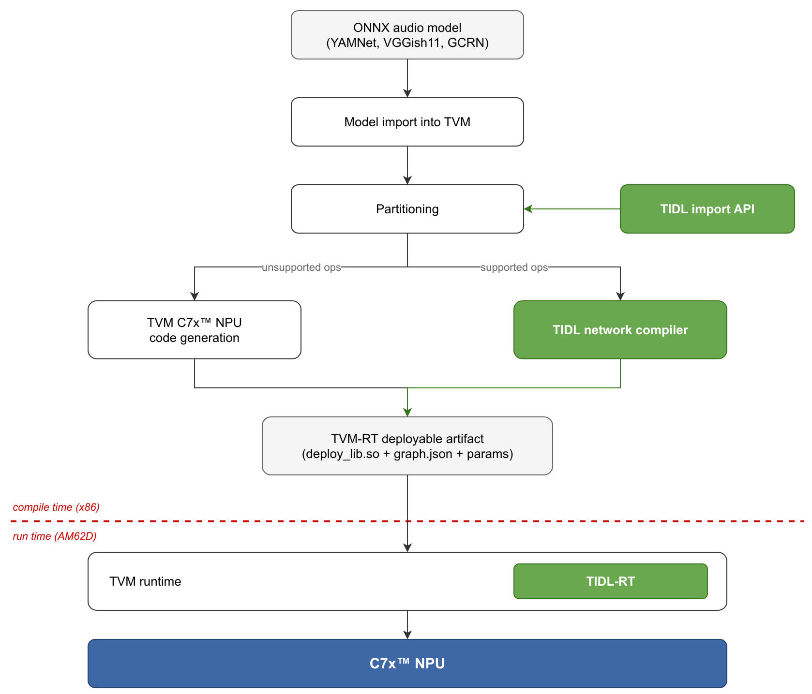

.. _audioai-introduction:

#######################
Introduction & Overview
#######################

.. |tm| unicode:: U+2122

This guide documents the audio deep-learning (Audio AI/DL) models supported on
the |__PART_FAMILY_NAME__| platform in |__SDK_FULL_NAME__| |__AUDIOAI_SDK_VERSION__|.
It is written for embedded developers who want to run, compile, evaluate, and
benchmark the supported audio models on the AM62D — either out of the box on the
target with pre-compiled artifacts, or through the x86 compile/evaluate workflow.

The remaining sections cover:

- :ref:`Audio AI Model Zoo <audioai-model-zoo>` — out-of-box demos on the AM62D
  target (inference scripts and Jupyter notebooks) using pre-trained models and
  pre-compiled artifacts.
- :ref:`Compile / Evaluate / Inspect <audioai-compile-evaluate-inspect>` — the
  x86 workflow built on ``edgeai-tidlrunner``: compile each model for the AM62D,
  evaluate accuracy on a dataset, and inspect the compiled subgraphs.
- :ref:`Performance benchmark <audioai-performance>` — latency and memory
  methodology with per-model tables.

********************
Supported models
********************

Four models are supported, in two task families. Every model is delivered as an
`ONNX <https://onnx.ai/>`__ graph and, except for GTCRN, is offloaded to the
C7x\ |tm| NPU through the TVM runtime (TVM-RT); GTCRN is the one model that runs
ARM-only. See :ref:`the framework overview <audioai-tvm-tidl>` below for what
that means.

Audio analysis and classification
==================================

**VGGish11** (model ID |__MODEL_ID_VGGISH11__|)
   Audio-clip classification. Input is a log-mel patch of shape ``(1, 1, 64, 126)``;
   output is ``(1, 10)`` class logits plus a ``(1, 512)`` embedding. Runs at 8-bit,
   fully offloaded to the C7x\ |tm| NPU via TVM-RT (a single TIDL subgraph).

**YAMNet** (model ID |__MODEL_ID_YAMNET__|)
   Audio-event classification. Input is a log-mel patch of shape ``(1, 1, 96, 64)``;
   output is ``(1, 521)`` class scores. Runs at 8-bit, fully offloaded to the
   C7x\ |tm| NPU via TVM-RT (a single TIDL subgraph).

Both classification models are evaluated on the |__DATASET_AUDIO_CLS__| dataset.

Speech enhancement
==================

**GCRN** (model ID |__MODEL_ID_GCRN__|)
   Convolutional-recurrent speech enhancement (denoising) over a fixed 4-second
   window. Input and output are complex spectrograms of shape ``(1, 2, 401, 161)``.
   Runs at 16-bit and is offloaded to the C7x\ |tm| NPU via TVM-RT
   (``tidl_offload: true``).

**GTCRN** (model ID |__MODEL_ID_GTCRN__|)
   Grouped temporal convolutional-recurrent speech enhancement. Input and output
   are complex spectrograms of shape ``(1, 257, T, 2)`` with a dynamic time
   dimension ``T``. Runs FP32 on the Arm core through the ONNX runtime
   (``tidl_offload: false``) — it is the only supported model that is **not**
   offloaded to the C7x\ |tm| NPU.

Both speech-enhancement models are evaluated on the |__DATASET_SPEECH_ENH__|
dataset.

.. _audioai-tvm-tidl:

**************************
TVM + TIDL framework
**************************

The AM62D audio models are compiled and deployed with **TI TVM**, TI's fork of
the `Apache TVM <https://tvm.apache.org/>`__ deep-learning compiler. TI TVM
integrates **TIDL** (TI Deep Learning) as an accelerator backend so that the
layers TIDL supports execute with optimized C7x\ |tm| NPU performance, while any
remaining layers are covered by TVM's own C7x\ |tm| NPU code generation. The
result is a single deployable artifact in which the **entire model runs on the
C7x**\ |tm| **NPU**.

Compilation runs on an x86 host and proceeds in stages:

#. **Model import** — the ONNX graph is imported into TVM.
#. **Partitioning** — using the TIDL import API, the graph is split into
   TIDL-supported subgraphs (compiled by the TIDL network compiler) and the
   remaining operators (handled by TVM C7x\ |tm| NPU code generation).
#. **Artifact generation** — both parts are packaged into one TVM-RT deployable
   artifact (``deploy_lib.so`` + ``deploy_graph.json`` + ``deploy_param.params``).

At run time on the AM62D, the TVM runtime loads the artifact and dispatches the
offloaded subgraphs to TIDL-RT on the C7x\ |tm| NPU.

   TVM + TIDL compile-and-deploy flow for the AM62D audio models. Green blocks
   are handled by TIDL; white blocks are handled by TVM. VGGish11, YAMNet, and
   GCRN follow this offloaded path; GTCRN runs ARM-only on the ONNX runtime.

.. TODO(WI-002): confirm the TVM + TIDL diagram concept with Anand Pathak before release.
